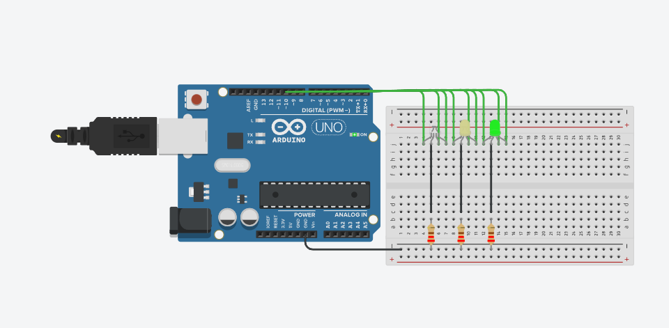

# Arduino Traffic Light Simulator

A traffic light (semaphore) simulation built with Arduino UNO and three LEDs, cycling through a standard Red → Yellow → Green → Yellow sequence.

> Designed and simulated in [Tinkercad Circuits](https://www.tinkercad.com/).

---

## Demo



---

## How It Works

The sketch controls three LEDs using a `3×3` pin matrix — each LED has three assigned digital pins (R, G, B channels). Only the relevant channel is driven HIGH per phase, with the middle LED combining Red + Green to produce yellow.

| Phase  | Active LED | State        | Duration |
|--------|-----------|--------------|----------|
| 1      | LED 0     | Red          | 2000 ms  |
| 2      | LED 1     | Yellow (R+G) | 1500 ms  |
| 3      | LED 2     | Green        | 2000 ms  |
| 4      | LED 1     | Yellow (R+G) | 1500 ms  |

Then repeats.

---

## Pin Mapping

| LED Index | Red Pin | Green Pin | Blue Pin |
|-----------|---------|-----------|----------|
| 0         | 2       | 3         | 4        |
| 1         | 5       | 7         | 6        |
| 2         | 8       | 10        | 9        |

---

## Components

- 1× Arduino UNO
- 3× LEDs (Red, Yellow/Amber, Green)
- 3× 220Ω resistors
- 1× Breadboard
- Jumper wires

---

## Getting Started

### Tinkercad (simulation)

1. Open the [Tinkercad project](#) *(replace with your share link)*
2. Click **Start Simulation**

### Physical build

1. Wire the circuit following the pin mapping table above
2. Each LED cathode connects to GND through a 220Ω resistor
3. Open `ArduinoP2Semaforo.ino` in the Arduino IDE
4. Select board: **Arduino UNO** and the correct COM port
5. Click **Upload**

---

## Project Structure

```
arduino-traffic-light/
├── ArduinoP2Semaforo.ino   # Main sketch
├── circuit.png              # Circuit diagram screenshot
└── README.md
```

---

## License

MIT